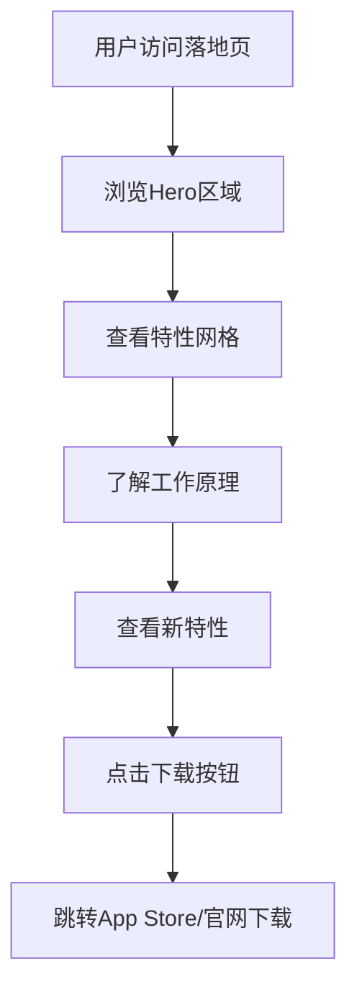

## 1. Product Overview

Prism是一款专为macOS设计的智能浏览器路由应用，通过本地处理实现快速、轻量级的网络连接管理。本落地页旨在向macOS用户展示Prism的核心价值和功能特性，吸引用户下载使用。

* 解决macOS用户多浏览器环境下的智能路由需求

* 目标用户：macOS平台的高级用户、开发者、网络管理员

* 市场价值：填补macOS平台智能浏览器路由工具的市场空白

## 2. Core Features

### 2.1 User Roles

| Role  | Registration Method | Core Permissions |
| ----- | ------------------- | ---------------- |
| 访客用户  | 无需注册                | 浏览产品信息、下载应用      |
| 已下载用户 | 应用内激活               | 使用完整应用功能         |

### 2.2 Feature Module

营销落地页包含以下核心页面：

1. **首页**：完整的产品展示和下载引导页面

### 2.3 Page Details

| Page Name | Module Name | Feature description                  |
| --------- | ----------- | ------------------------------------ |
| 首页        | Header导航栏   | 显示Prism logo和下载按钮，固定顶部导航             |
| 首页        | Hero主视觉区    | 展示应用截图、核心卖点标题、副标题描述                  |
| 首页        | 特性展示网格      | 展示原生macOS UI设计、智能路由规则、性能优势、隐私保护等核心特性 |
| 首页        | 工作原理说明      | 通过图文结合说明应用的工作机制和使用场景                 |
| 首页        | 新特性展示       | 重点介绍鼠标跟随弹窗和水平滚动等创新功能                 |
| 首页        | 下载/页脚区域     | 提供下载按钮、系统要求、联系方式等信息                  |

## 3. Core Process

用户访问流程：

1. 用户通过搜索引擎或直接访问进入落地页
2. 首先看到Hero区域的应用截图和价值主张
3. 向下滚动浏览特性网格，了解核心功能
4. 查看工作原理和新特性介绍
5. 在页脚区域找到下载按钮完成下载

## 4. User Interface Design

### 4.1 Design Style

* **主色调**：app 图标配色和 ui 主配色。

* **辅助色**：玻璃拟态效果使用半透明背景（rgba(255,255,255,0.1)）

* **按钮样式**：圆角矩形，悬停时有微妙的光影效果

* **字体**：SF Pro Display（标题）+ SF Pro Text（正文），符合macOS设计语言

* **布局风格**：单页滚动设计，采用卡片式模块布局

* **图标风格**：使用SF Symbols风格的线性图标，保持与macOS系统一致性

### 4.2 Page Design Overview

| Page Name | Module Name | UI Elements                                         |
| --------- | ----------- | --------------------------------------------------- |
| 首页        | Header导航栏   | 左侧Prism logo（玻璃拟态效果），右侧下载按钮（蓝色渐变背景），固定在顶部，滚动时背景模糊   |
| 首页        | Hero主视觉区    | 大尺寸应用界面截图（带窗口阴影），标题使用48px加粗字体，副标题20px常规字体，CTA按钮醒目展示 |
| 首页        | 特性展示网格      | 4列网格布局，每个特性包含图标、标题、描述文字，卡片采用玻璃拟态背景，悬停时有微妙动画         |
| 首页        | 工作原理说明      | 左右图文交替布局，使用macOS风格的截图和说明文字，展示URL模式匹配和规则设置界面         |
| 首页        | 新特性展示       | 鼠标跟随弹窗使用动态演示，水平滚动功能通过交互式演示展示，突出创新体验                 |
| 首页        | 下载/页脚区域     | 大尺寸下载按钮（蓝色渐变），系统要求说明（macOS 11.0+），简洁的联系方式和版权信息      |

### 4.3 Responsiveness

* **桌面优先**：针对macOS用户的桌面浏览体验优化

* **移动端适配**：支持iPhone/iPad浏览，保持核心信息可读性

* **Retina显示优化**：所有图片资源提供@2x版本，确保在高分辨率屏幕上的清晰度

* **滚动优化**：支持平滑滚动和惯性滚动，符合macOS用户习惯

