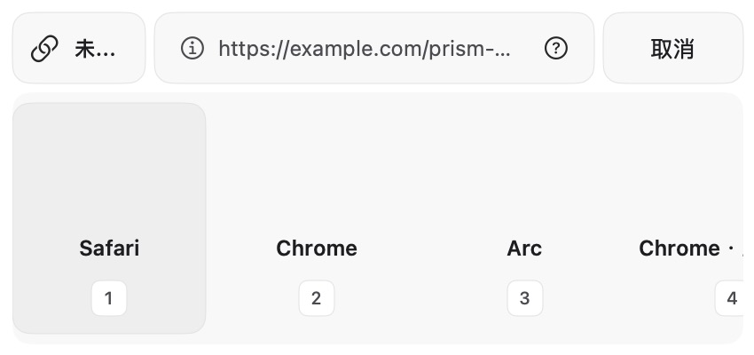
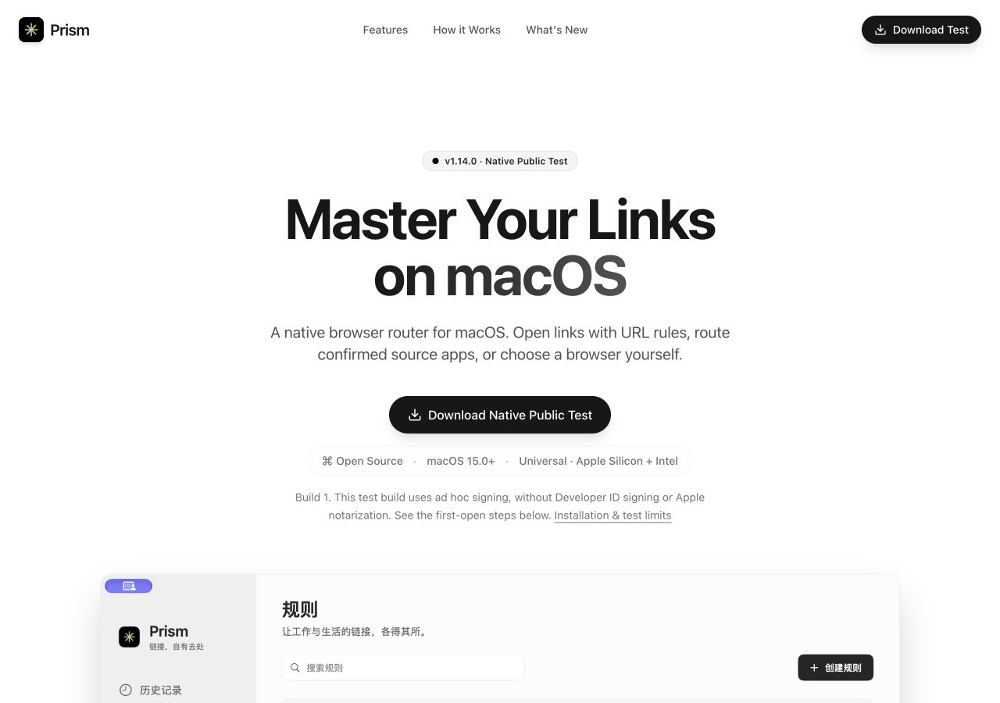
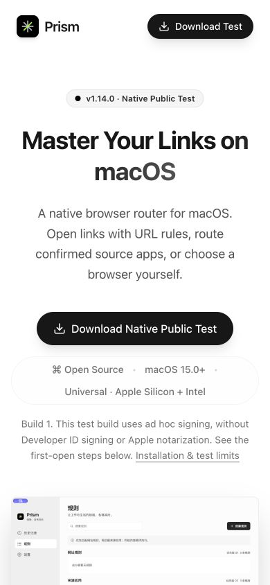
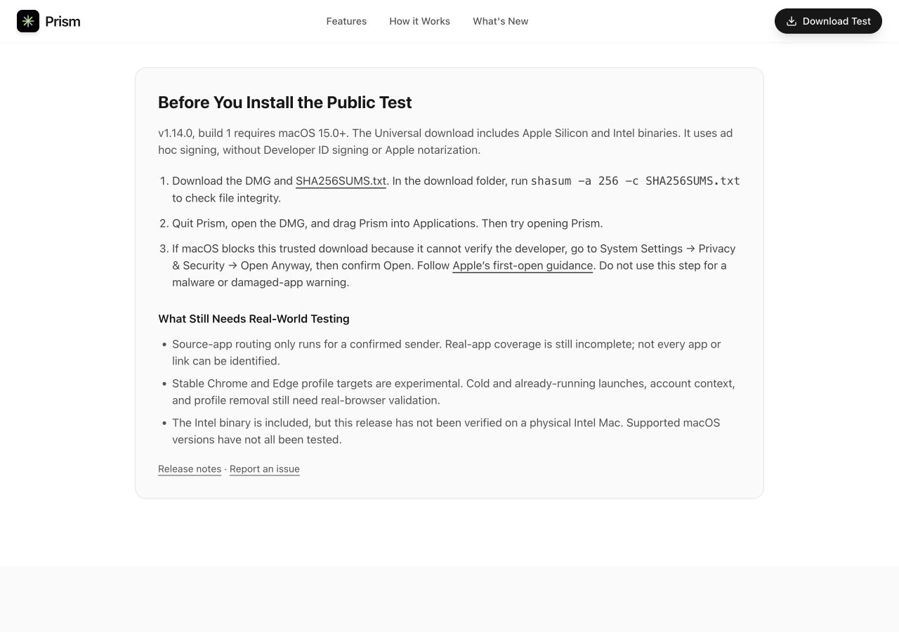

# 产品迭代与验收记录

日期：2026-09-30。工作区：`Prism-product-iterations`，分支：`feature/product-iterations-20260930`。

本轮按产品评估顺序实施交付入口、来源可靠性、Chrome／Edge Profile、规则编辑、预览与历史解释、浏览器管理。开发者账户签名和 Apple 公证按用户要求跳过；候选包使用本地 ad hoc 签名。后续用户授权按无开发者账户的公测方案发布，交付范围扩展为 GitHub Pre-release 和现有官网更新。验证不替换用户安装的 Prism、不修改系统默认浏览器、不重置用户数据。

## 版本边界

原生应用和官网发布配置统一为 **1.14.0 / Build 1**，要求 macOS 15+，Universal 包包含 arm64 与 x86_64。下载使用精确版本链接，避免 `releases/latest` 指向旧 Electron 稳定版。发布说明明确 ad hoc 签名、未公证和实机验收缺口。官网现有界面截图为旧版本示意图，已有明确说明；新选择器的实际验证截图见本记录。

## 完成的产品变化

| 顺序 | 变化 | 验证边界 |
| --- | --- | --- |
| P0 交付入口 | 统一版本、精确下载资产、系统和架构要求，明确公测及未公证状态；修复旧版本和过期能力描述。 | 官网构建／lint、远端下载与校验、桌面和 390px 窄屏 CUA 检查已完成。 |
| P0 来源可靠性 | 单次系统确认与应用实测资格分开显示；已确认且非空来源可先建规则，low／unknown 不可快捷建来源规则；实测名单保持为空。 | 确认门槛及状态测试、独立预期身份／capture UUID 探针与汇总测试。真实来源矩阵仍待验收。 |
| P1 多账号目标 | Chrome／Edge Profile 使用稳定目录 ID；兼容原浏览器 ID；仅读取名称及目录元信息。失效 Profile 不创建、不回退到其他账号。 | 临时目录发现、安全校验、旧 Codable、启动 argv 与 completion 测试；真实浏览器冷／热启动仍待验收。 |
| P1 规则编辑 | 原有规则入口支持预填、范围和目标预览；新规则保存后可撤销。按用户最新要求删除弹窗底部“此网站以后这样打开…”入口，恢复 425×200 布局。 | 撤销只针对保存成功的新规则，失败保留重试，规则改动后拒绝误删。底部专用菜单、文案和高度已移除。 |
| P1 路由可解释 | 同一 RuleEngine 预览当前 URL／模拟来源；历史显示记录的实际方式和目标，并提供当前规则纠正入口。 | 不启动浏览器；历史没有规则快照时明确说明，不能把当前规则当作当时规则。 |
| P1 日常选择 | 保存隐藏和顺序，保留暂时不可用目标偏好；隐藏不影响规则、首选和历史重试。全部隐藏后可直接进入内置管理。 | 旧 payload 兼容、独立字段保存、隐藏 Profile 规则命中及删除后不可用回归。 |
| P1 状态与中文 | 无匹配／暂停／来源未确认采用中性提示；真正失败保留警告；补齐中文、完整来源帮助和按钮辅助标签。 | 图形和辅助树单独检查；不据此宣称完整无障碍合规。 |

## 验证记录

- 基线：PrismCore 81 项；原生 377 项通过。
- 最终 PrismCore：83 项通过。
- Probe 汇总：15 项合成样本测试通过；不属于真人点击证据。
- 删除底部入口后的原生单测：421 项／38 套件通过（移除了该入口专用的 1 项几何测试）。
- 官网 TypeScript／生产构建／ESLint 通过；本地化 plutil 和 git diff --check 通过。
- 最终 Universal 公测候选包：Release 构建、ad hoc 签名校验、5 秒启动冒烟、DMG 校验与挂载复核通过。
- 启动冒烟脚本增加系统 sandbox，拒绝读取或写入当前账户的生产 Prism 数据目录；7 项脚本回归通过，DMG 中应用在该隔离条件下启动并保持运行 5 秒。此结果不等于真实持久化及链接路由验收。
- 公测官网 CUA：1280×900 桌面、390×844 窄屏、首次打开说明锚点通过；浏览器 error/warn 日志为空。
- XCUITest 首次完整运行 30 项：29 项通过，拖动用例失败。诊断确认用例错误使用触摸 `press` API，没有发送鼠标事件；改为 macOS `click` 拖动 API，保留坐标、时长及全部断言，原拖动验收复验通过。临时事件日志已移除，产品手势代码未改。
- 隔离应用 CUA：已看到移除底部入口后的 425×200 弹窗，方向键切换、数字 4 选择 Profile、历史显示实际目标通过；浏览器管理隐藏／排序值即时更新。使用独立 bundle ID、内存仓库和 stub launcher，不影响生产配置，也不代表真实浏览器交接成功。
- 修复集成审查发现的重复管理行身份、持久化失败回滚、规则编辑待处理意图问题；另修复首页测试链接在完成引导后不响应的问题。对应回归已通过。

公开安装包：[Prism-1.14.0-universal-test.dmg](https://github.com/Halewwang/Prism-Browser-switching/releases/download/v1.14.0/Prism-1.14.0-universal-test.dmg)。SHA-256：`feb8eb896bd7f654048b9384fb331f7f17a5fe1d780de1fcaf06dd557b30b8f0`。

2026-09-30 发布记录：[v1.14.0](https://github.com/Halewwang/Prism-Browser-switching/releases/tag/v1.14.0) 以 Pre-release 公开，源码标签对应 `e6c3f5ce083da1bc416eea7ff49b2406c629f462`。上传后从 GitHub 草稿重新下载 DMG 和校验文件，SHA-256 与本地一致。官网更新通过现有 Vercel Git 集成部署，不创建新项目。

## 真实验收缺口

[release-acceptance.md](../native/docs/release-acceptance.md) 中的来源应用冷 20／热 20 点击、Chrome／Edge 冷／热 Profile、登录跳转、跨 macOS／Intel 和恢复异常，尚无完整实机证据。当前不得把来源应用标记为“已验证支持”，也不能把 stub 启动参数当成真实账号隔离验证。候选版适合有明确反馈范围的试用，完成这些验收后再扩大推广。

## 候选界面证据

## 官网证据

